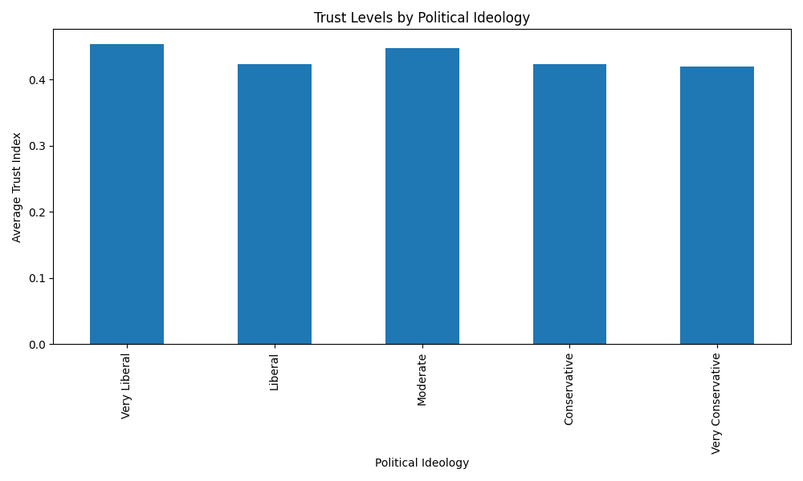
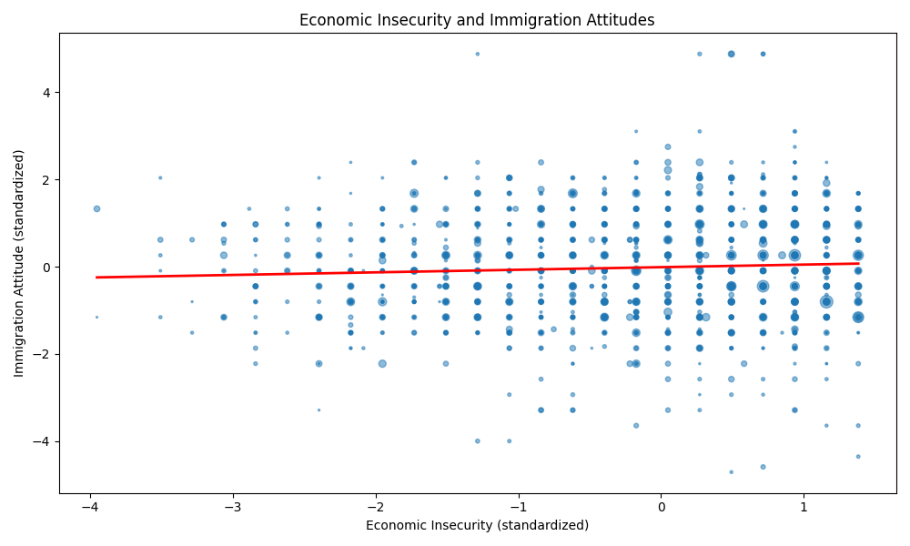
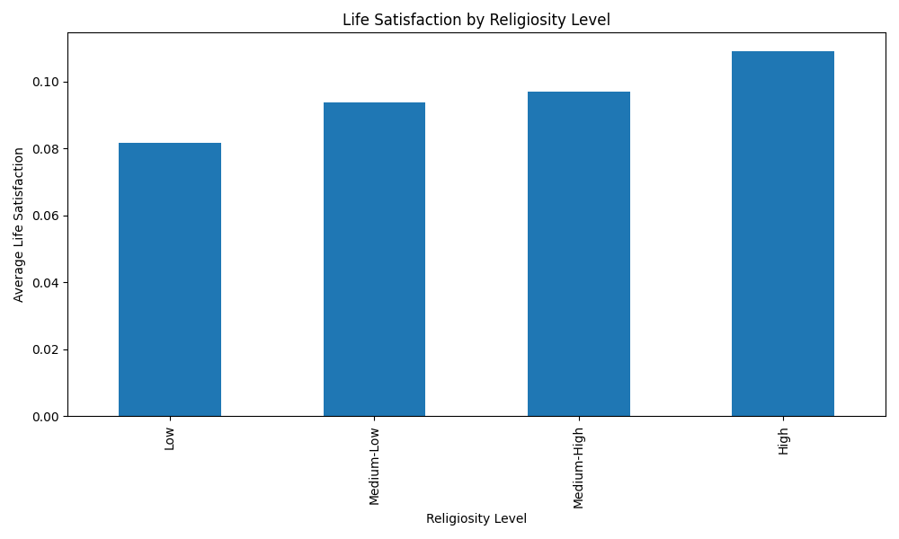

# WVS Wave 7 USA Data Analysis Results

Dataset: WVS Wave 7 (2017-2022)
Country: United States (B_COUNTRY = 840)
Sample Weight: S017

## Research 1: The Political Polarization of Trust: How Political Ideology Shapes Institutional and Interpersonal Trust in Contemporary America

### Key Findings:
- R-squared: 0.005
- const: 0.451 (p=0.000)***
- political_ideology: -0.032 (p=0.001)***

### Visualization:


### Model Summary:
```
                            WLS Regression Results                            
==============================================================================
Dep. Variable:            trust_index   R-squared:                       0.005
Model:                            WLS   Adj. R-squared:                  0.004
Method:                 Least Squares   F-statistic:                     11.74
Date:                Thu, 17 Jul 2025   Prob (F-statistic):           0.000621
Time:                        08:32:37   Log-Likelihood:                 1280.2
No. Observations:                2536   AIC:                            -2556.
Df Residuals:                    2534   BIC:                            -2545.
Df Model:                           1                                         
Covariance Type:            nonrobust                                         
======================================================================================
                         coef    std err          t      P>|t|      [0.025      0.975]
--------------------------------------------------------------------------------------
const                  0.4509      0.005     87.842      0.000       0.441       0.461
political_ideology    -0.0318      0.009     -3.427      0.001      -0.050      -0.014
==============================================================================
Omnibus:                      269.825   Durbin-Watson:                   1.691
Prob(Omnibus):                  0.000   Jarque-Bera (JB):             1370.789
Skew:                           0.377   Prob(JB):                    2.17e-298
Kurtosis:                       6.522   Cond. No.                         4.49
==============================================================================

Notes:
[1] Standard Errors assume that the covariance matrix of the errors is correctly specified.
```

## Research 2: Economic Insecurity and Social Values: How Financial Stress Shapes Americans' Attitudes Toward Immigration and Social Welfare

### Key Findings:
- R-squared: 0.004
- const: -0.011 (p=0.593)
- econ_insecurity_std: 0.059 (p=0.002)**

### Visualization:


### Model Summary:
```
                               WLS Regression Results                               
====================================================================================
Dep. Variable:     immigration_attitude_std   R-squared:                       0.004
Model:                                  WLS   Adj. R-squared:                  0.003
Method:                       Least Squares   F-statistic:                     9.219
Date:                      Thu, 17 Jul 2025   Prob (F-statistic):            0.00242
Time:                              08:32:37   Log-Likelihood:                -4000.6
No. Observations:                      2589   AIC:                             8005.
Df Residuals:                          2587   BIC:                             8017.
Df Model:                                 1                                         
Covariance Type:                  nonrobust                                         
=======================================================================================
                          coef    std err          t      P>|t|      [0.025      0.975]
---------------------------------------------------------------------------------------
const                  -0.0106      0.020     -0.535      0.593      -0.049       0.028
econ_insecurity_std     0.0593      0.020      3.036      0.002       0.021       0.098
==============================================================================
Omnibus:                      235.600   Durbin-Watson:                   1.977
Prob(Omnibus):                  0.000   Jarque-Bera (JB):             1453.028
Skew:                           0.158   Prob(JB):                         0.00
Kurtosis:                       6.656   Cond. No.                         1.02
==============================================================================

Notes:
[1] Standard Errors assume that the covariance matrix of the errors is correctly specified.
```

## Research 3: Religion, Science, and Well-being: Exploring the Paradox of Faith and Happiness in Secular America

### Key Findings:
- R-squared: 0.017
- const: 0.042 (p=0.000)***
- religiosity: 0.019 (p=0.000)***

### Visualization:


### Model Summary:
```
                            WLS Regression Results                            
==============================================================================
Dep. Variable:      life_satisfaction   R-squared:                       0.017
Model:                            WLS   Adj. R-squared:                  0.017
Method:                 Least Squares   F-statistic:                     45.23
Date:                Thu, 17 Jul 2025   Prob (F-statistic):           2.15e-11
Time:                        08:32:37   Log-Likelihood:                 2852.2
No. Observations:                2586   AIC:                            -5700.
Df Residuals:                    2584   BIC:                            -5689.
Df Model:                           1                                         
Covariance Type:            nonrobust                                         
===============================================================================
                  coef    std err          t      P>|t|      [0.025      0.975]
-------------------------------------------------------------------------------
const           0.0417      0.008      5.295      0.000       0.026       0.057
religiosity     0.0185      0.003      6.725      0.000       0.013       0.024
==============================================================================
Omnibus:                      230.418   Durbin-Watson:                   1.980
Prob(Omnibus):                  0.000   Jarque-Bera (JB):              755.791
Skew:                           0.431   Prob(JB):                    7.62e-165
Kurtosis:                       5.505   Cond. No.                         18.0
==============================================================================

Notes:
[1] Standard Errors assume that the covariance matrix of the errors is correctly specified.
```

